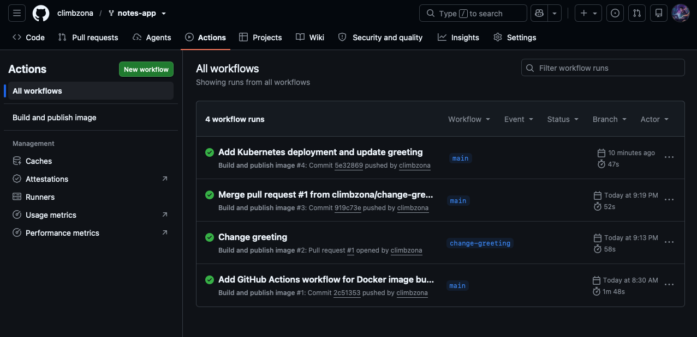
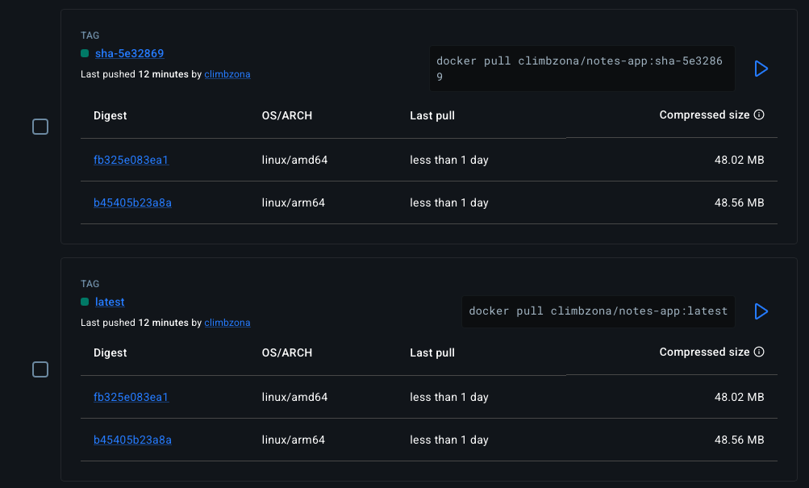

# Lab 5 Evidence

## GitHub Actions

Successful GitHub Actions workflow run for the Docker image build and publish pipeline.



## Docker Hub Multi-Architecture Image

Docker Hub tags for the published image showing support for both `linux/amd64` and `linux/arm64`.



## Kubernetes Resources

`kubectl get all,pvc` from the running Kubernetes cluster:

```
glucero@Mini-M4 notes-app % kubectl get all,pvc
NAME                       READY   STATUS    RESTARTS   AGE
pod/db-6c5c8947cd-nqpzg    1/1     Running   0          30m
pod/web-6c4994f757-fdhv6   1/1     Running   0          11m
pod/web-6c4994f757-plbhc   1/1     Running   0          11m

NAME          TYPE        CLUSTER-IP      EXTERNAL-IP   PORT(S)    AGE
service/db    ClusterIP   10.96.55.86     <none>        5432/TCP   63m
service/web   ClusterIP   10.96.210.226   <none>        80/TCP     52m

NAME                  READY   UP-TO-DATE   AVAILABLE   AGE
deployment.apps/db    1/1     1            1           63m
deployment.apps/web   2/2     2            2           52m

NAME                             DESIRED   CURRENT   READY   AGE
replicaset.apps/db-6c5c8947cd    1         1         1       63m
replicaset.apps/web-558bd8458c   0         0         0       15m
replicaset.apps/web-669cf5ddd5   0         0         0       52m
replicaset.apps/web-6c4994f757   2         2         2       38m

NAME                            STATUS   VOLUME                                     CAPACITY   ACCESS MODES   STORAGECLASS   VOLUMEATTRIBUTESCLASS   AGE
persistentvolumeclaim/db-data   Bound    pvc-c6bf6f7e-0583-4199-8bdb-88a7e545ac2b   1Gi        RWO            standard       <unset>                 63m
```

## Data Persistence

After creating a note, the database pod was deleted and Kubernetes created a replacement pod. The previously created note remained available:

```
glucero@Mini-M4 ~ % curl http://localhost:8000/notes
[{"body":"hello from kubernetes","created_at":"2026-09-30T05:10:30.126587+00:00","id":1}]
```

## Service Load Balancing

Requests made to the `web` Service from inside the Kubernetes cluster returned responses from multiple web pods:

```
glucero@Mini-M4 ~ % kubectl run curl --rm -it --restart=Never --image=curlimages/curl -- \
  sh -c 'for i in 1 2 3 4 5 6 7 8; do curl -s http://web/; echo; done'

{"message":"Hello from Gabe's notes app!","served_by":"web-6c4994f757-swhpp","service":"notes-app"}

{"message":"Hello from Gabe's notes app!","served_by":"web-6c4994f757-gwnzf","service":"notes-app"}

{"message":"Hello from Gabe's notes app!","served_by":"web-6c4994f757-swhpp","service":"notes-app"}
```

Multiple `served_by` values demonstrate that the Kubernetes Service distributed requests across web replicas.

## Rolling Update and Rollback

The web Deployment was updated to the immutable image `climbzona/notes-app:sha-5e32869`, the rollout completed successfully, and the Deployment was then rolled back.

```
glucero@Mini-M4 ~ % kubectl rollout history deployment/web
deployment.apps/web
REVISION  CHANGE-CAUSE
1         <none>
3         <none>
4         <none>
```